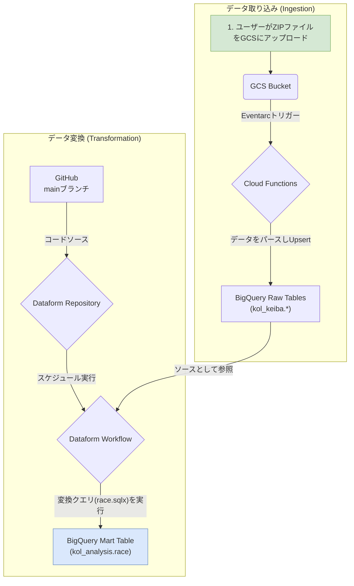

# KOL競馬データ処理・変換パイプライン on GCP

このリポジトリは、Google Cloud Platform (GCP) 上に、競馬データ（KOL形式）を処理・変換するためのデータパイプラインを構築するものです。

主な機能は以下の2つです。
1.  **データ取り込み**: GCSへのファイルアップロードをトリガーに、Cloud Functionsがデータをパースし、BigQueryの生データテーブルに格納します。
2.  **データ変換**: Dataformを使い、BigQuery上の生データを分析しやすい形式（データマート）に変換します。この変換処理は、GitHubの`main`ブランチを元に、毎日定時に自動実行されます。

インフラの構築からデータ変換のロジックまで、すべてがコードとして管理されています。

## アーキテクチャ



1.  **データ取り込み**: ユーザーがKOLデータを含むZIPファイルをGCSにアップロードすると、Cloud Functionが起動し、BigQueryの`kol_keiba`データセットに生データを書き込みます。
2.  **データ変換**: DataformはGitHubリポジトリの`main`ブランチを監視します。毎日午前7時になると、スケジュールされたワークフローが起動し、`kol_keiba`の生データを参照して`kol_analysis.race`テーブルを生成・更新します。

## 技術スタック

- **クラウド**: Google Cloud Platform
  - **コンピューティング**: Cloud Functions (第2世代)
  - **ストレージ**: Cloud Storage (GCS)
  - **DWH**: BigQuery
  - **データ変換**: Dataform
  - **イベント**: Eventarc
  - **ID管理**: IAM, Secret Manager
- **IaC**: Terraform
- **バージョン管理**: GitHub
- **言語**: Python (Cloud Functions), SQL (Dataform)

## ディレクトリ構成

```
.
├── terraform/      # GCPインフラを定義するTerraformコード
│   ├── dataform.tf
│   └── ...
├── package.json
├── dataform.json
└── definitions/
    ├── sources/
    │   └── kol_sources.js
    └── race.sqlx
```

## セットアップとデプロイ手順

### 1. 前提条件

- Google Cloud SDK (gcloud CLI) がインストール済みであること。
- Terraform がインストール済みであること。
- GCPプロジェクトで課金が有効になっていること。
- GitHubリポジトリ (`https://github.com/ENDoDo/kol-gcp-dataform`) への書き込み権限があること。

### 2. 環境設定

```bash
# GCPにログイン
gcloud auth login

# 使用するプロジェクトIDを設定
gcloud config set project smartkeiba

# アプリケーションのデフォルト認証情報を設定
gcloud auth application-default login
```

### 3. GitHub Personal Access Token (PAT) の設定

DataformがGitHubリポジトリにアクセスするために、認証用のトークンをSecret Managerに設定します。

1.  GitHubで、リポジトリ (`repo`) スコープを持つPersonal Access Token (Classic) を作成します。
2.  GCPコンソールでSecret Managerに移動し、`github-token` という名前のシークレットを作成します。
3.  作成したシークレットに、GitHubのPATをシークレットの値として追加します。

### 4. インフラのデプロイ

```bash
# Terraformディレクトリに移動
cd terraform

# Terraformを初期化 (プロバイダのバージョンを更新するため-upgradeを推奨)
terraform init -upgrade

# (任意) どのようなリソースが作成されるか確認
terraform plan

# リソースをGCP上に作成
terraform apply
```
`apply`が完了すると、GCSバケット、Cloud Function、Dataformリポジトリと自動実行ワークフローなどが構築されます。

## パイプラインの実行方法

1.  **データ取り込み**: KOLデータを含む`.zip`ファイルを、Terraformが作成したGCSバケット (`kol-keiba-bucket`) にアップロードします。Cloud Functionが自動で起動し、BigQueryの`kol_keiba`データセットにデータが格納されます。
2.  **データ変換**: `terraform apply`で設定されたスケジュール (`毎日午前7時 JST`) になると、Dataformのワークフローが自動的に実行され、`kol_analysis.race`テーブルが更新されます。

## クリーンアップ

作成したすべてのGCPリソースを削除するには、以下のコマンドを実行します。

```bash
cd terraform
terraform destroy
```