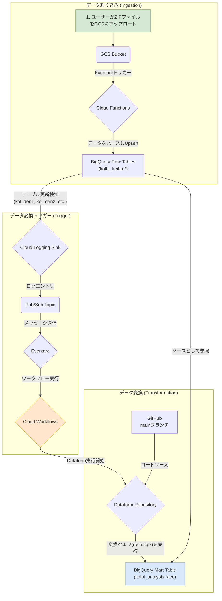

# KOL競馬データ処理・変換パイプライン on GCP

このリポジトリは、GCP上に構築された競馬データパイプラインの**データ変換（Transformation）**部分を担います。

GCSにアップロードされ、BigQueryの生テーブルに格納されたKOL競馬データをソースとして、**Dataform**を使い分析用のデータマート（`kolbi_analysis.race`）を構築します。

このリポジトリでは、主に以下の2点をコードで管理しています。
1.  **データ変換ロジック**: `dataform/`ディレクトリに格納された、`race`テーブルを生成するためのSQLXファイル。
2.  **インフラストラクチャ (IaC)**: `terraform/`ディレクトリに格納された、Dataformリポジトリや自動実行ワークフローを定義するTerraformコード。

**Note**: データ取り込み（Ingestion）部分（Cloud FunctionによるGCSからのデータロード）は、このリポジトリの管理範囲外です。

インフラの構築からデータ変換のロジックまで、すべてがコードとして管理されています。

## アーキテクチャ



1.  **データ取り込み**: ユーザーがKOLデータを含むZIPファイルをGCSにアップロードすると、Cloud Functionが起動し、BigQueryの`kolbi_keiba`データセットに生データを書き込みます。
2.  **データ変換トリガー**: BigQueryの特定のテーブル（`kol_den1`, `kol_den2`, `kol_ket`, `kol_sei1`, `kol_sei2`）が更新されると、Cloud Logging Sinkがそれを検知し、Pub/Sub経由でEventarcに通知します。EventarcはCloud Workflowsを起動します。
3.  **データ変換**: Cloud WorkflowsはDataformのワークフローを開始します。Dataformは`kolbi_keiba`の生データを参照して、`kolbi_analysis.race`を含むプロジェクト内のすべてのテーブルを生成・更新します。

## 技術スタック

- **クラウド**: Google Cloud Platform
  - **コンピューティング**: Cloud Functions (第2世代), Cloud Workflows
  - **ストレージ**: Cloud Storage (GCS)
  - **DWH**: BigQuery
  - **データ変換**: Dataform
  - **イベント**: Eventarc, Pub/Sub, Cloud Logging
  - **ID管理**: IAM, Secret Manager
- **IaC**: Terraform
- **バージョン管理**: GitHub
- **言語**: Python (Cloud Functions), SQL (Dataform), YAML (Cloud Workflows)

## ディレクトリ構成

```
.
├── terraform/      # GCPインフラを定義するTerraformコード
│   ├── dataform.tf
│   ├── workflows.tf # Cloud Workflowsの定義
│   ├── triggers.tf  # Eventarc, Pub/Sub, Logging Sinkの定義
│   └── ...
├── package.json
├── dataform.json
└── definitions/
    ├── sources/
    │   └── sources.js
    └── race.sqlx
```

## セットアップとデプロイ手順

### 1. 前提条件

- Google Cloud SDK (gcloud CLI) がインストール済みであること。
- Terraform がインストール済みであること。
- GCPプロジェクトで課金が有効になっていること。
- GitHubリポジトリ (`https://github.com/ENDoDo/kol-gcp-dataform`) への書き込み権限があること。

### 2. 環境設定

```bash
# GCPにログイン
gcloud auth login

# 使用するプロジェクトIDを設定
gcloud config set project smartkeiba

# アプリケーションのデフォルト認証情報を設定
gcloud auth application-default login
```

### 3. GitHub Personal Access Token (PAT) の設定

DataformがGitHubリポジトリにアクセスするために、認証用のトークンをSecret Managerに設定します。

1.  GitHubで、リポジトリ (`repo`) スコープを持つPersonal Access Token (Classic) を作成します。
2.  GCPコンソールでSecret Managerに移動し、`github-token` という名前のシークレットを作成します。
3.  作成したシークレットに、GitHubのPATをシークレットの値として追加します。

### 4. インフラのデプロイ

```bash
# Terraformディレクトリに移動
cd terraform

# Terraformを初期化 (プロバイダのバージョンを更新するため-upgradeを推奨)
terraform init -upgrade

# (任意) どのようなリソースが作成されるか確認
terraform plan

# リソースをGCP上に作成
terraform apply
```
`apply`が完了すると、GCSバケット、Cloud Function、Dataformリポジトリ、Cloud Workflows、およびトリガー設定などが構築されます。

## パイプラインの実行方法

1.  **データ取り込み**: KOLデータを含む`.zip`ファイルを、Terraformが作成したGCSバケット (`kol-keiba-bucket`) にアップロードします。Cloud Functionが自動で起動し、BigQueryの`kolbi_keiba`データセットにデータが格納されます。
2.  **データ変換**: BigQueryテーブルの更新が完了すると、自動的にDataformのワークフローが実行され、`kolbi_analysis.race`テーブルが更新されます。（スケジュール実行も設定されている場合は、指定時刻にも実行されます）

## クリーンアップ

作成したすべてのGCPリソースを削除するには、以下のコマンドを実行します。

```bash
cd terraform
terraform destroy
```